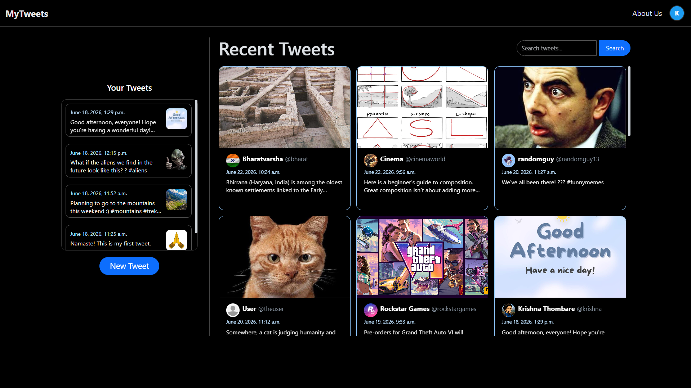
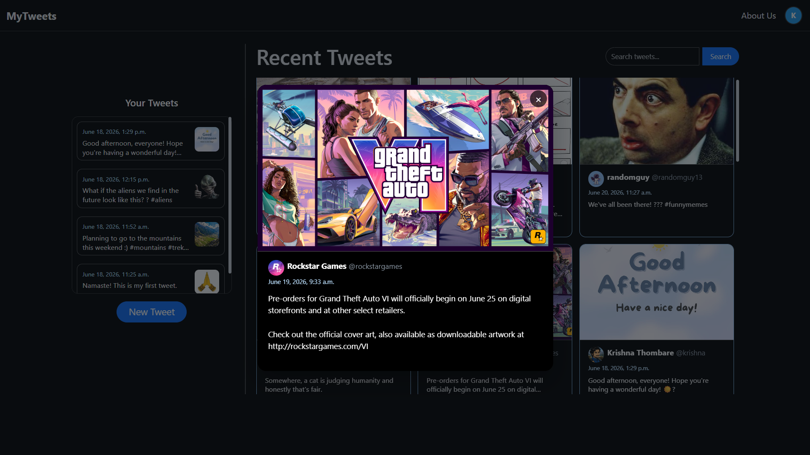
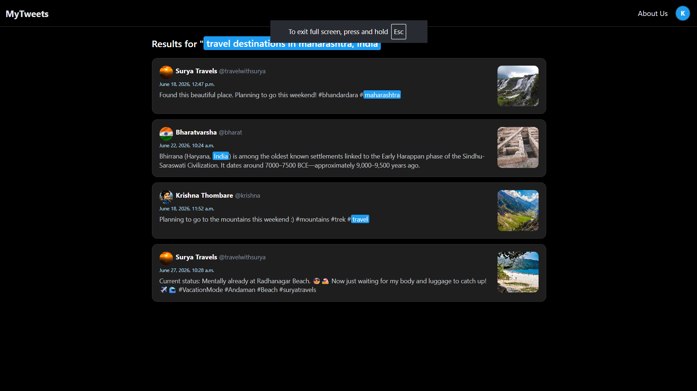
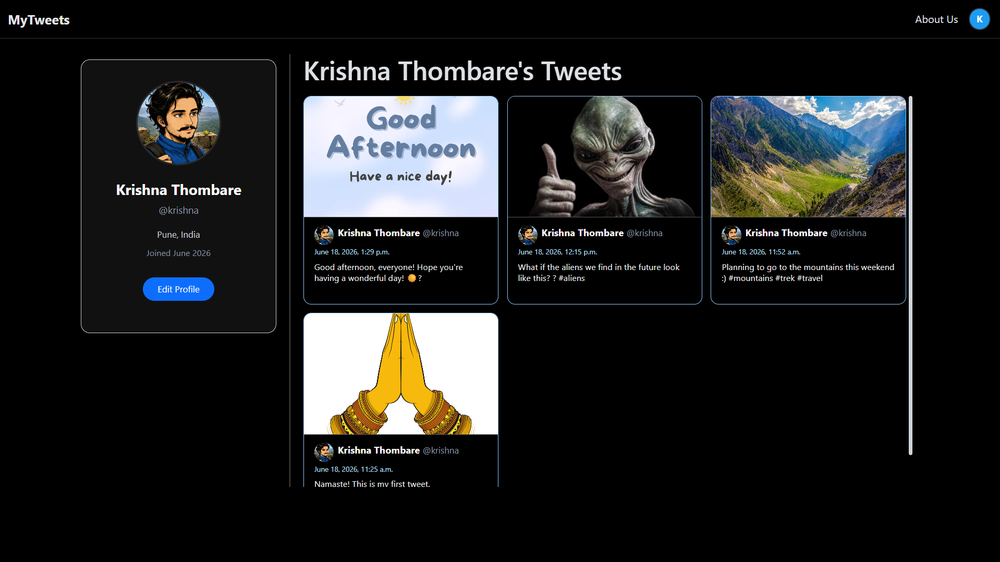

## 📌**Overview:**
My Tweets is a full-stack Django-based web application that allows users to create, manage, and share tweets with image uploads. The platform features user 
authentication, tweet exploration, profile management, tweet search functionality, and an iframe-based modal system for seamless interactions. It integrates 
Cloudinary for cloud-based media storage and Aiven Cloud for scalable PostgreSQL database hosting.

## ✨ **Features:**
1. User registration with unique @handle, profile photo, city and country.
2. Post tweets with optional photo attachments.
3. Public user profiles showing bio, location, joined date and their tweets. 
4. Clickable usernames and @handles linking to user profiles.
5. Popup modals for reading full tweet content and images.
6. Search tweets by text.
7. Cloud media storage via Cloudinary and PostgreSQL database via Aiven Cloud.

## 🛠️ **Tech Stack:**
1. Backend: Python, Django
2. Database: PostgreSQL (Aiven Cloud)
3. Frontend: HTML, CSS, Bootstrap
4. Media Storage: Cloudinary (Cloud Storage)
5. Deployment: Render

## 🧠 **Architecture:**
1. MVT architecture with server-side rendering using Django's template engine.
2. Django ORM for database interactions.
3. Session-based authentication using Django's built-in auth system.
4. Popup modal system for seamless in-page interactions.
5. Cloudinary for media storage and Aiven Cloud for PostgreSQL database.
6. Environment-based configuration using python-dotenv for secure credential management.
   
## 🚀 **Live Demo:**
https://mytweets-5xu8.onrender.com

## 📸 **Screenshots:**
### Home Page

### View Tweet

### Search Tweets

### Profile Page

## 🤝 **Contributing:**
Contributions are welcome! Feel free to fork the repository and submit a pull request.

## 📬 **Contact:**
Krishnathombare43@gmail.com

⭐**~ If you found this project useful, consider starring the repository!**

